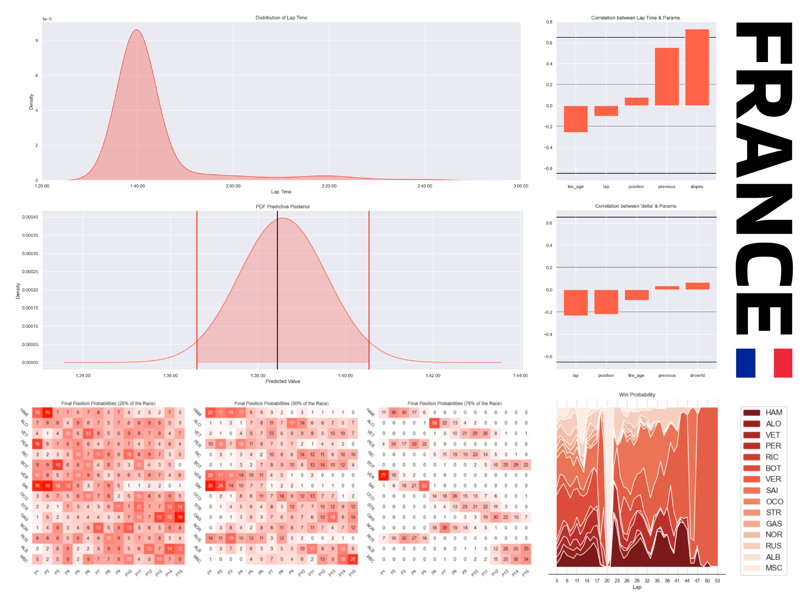

# About The Project
In this project, we are utilizing a Bayesian linear regression model to predict Formula 1 lap times based on various parameters. This approach allows us to conduct comprehensive race simulations, providing predictions of potential winners and enabling us to test and optimize race strategies. By incorporating Bayesian methods, we can account for uncertainty in our predictions and make more informed decisions during Formula 1 races. This innovative use of statistical modeling offers a powerful tool for teams and analysts in the motorsport industry to gain a competitive edge through data-driven insights and strategy refinement.

# Preview

This dashboard represents the results obtained from simulations carried out for the 2022 French Grand Prix. The distribution of lap times allows us to have a first approach to the data set while the two correlation diagrams give us the most significant parameters which will subsequently be used in our prediction model. The predictive posterior distribution gives us the average posterior distribution from the bayesian model. Each heatmap then gives us the probability (expressed as a percentage) for each driver to finish the race in a certain position. The prediction is given after completing 25%, 50% and 75% of the race. Finally, the area plot gives us, for each lap, the probability of victory for each driver. The larger the surface area under each curve, the more likely the driver is to win.

# Approach
Using a Bayesian approach in this prediction project, as opposed to a frequentist approach, was a deliberate choice driven by several compelling reasons. One key advantage lies in the incorporation of uncertainty into our predictions. Bayesian methods allow us to represent and quantify uncertainty in a natural way, which is crucial when dealing with complex, real-world systems like Formula 1 racing. This uncertainty-aware approach is particularly valuable for race predictions, as it acknowledges that there are inherent uncertainties in various aspects of the race, such as weather conditions, driver performance, and unexpected events. Furthermore, the Bayesian framework aligns seamlessly with Monte Carlo simulation techniques, which are inherently probabilistic. By adopting a Bayesian perspective, we maintain a coherent and consistent probabilistic framework throughout the entire project. This coherence between prediction and simulation methodologies ensures that our predictions are not only accurate but also harmoniously integrate with the Monte Carlo simulations used for race strategy optimization. In essence, the Bayesian approach offers a more holistic and flexible way to handle uncertainty and probabilistic reasoning, making it a superior choice for projects like ours in the context of Formula 1 prediction and simulation.

# Pros. & Cons.
## Advantages
* Easy to Implement
* Easy to Train
* Accurate Prediction
* Fit with Monte-Carlo Simulation
* May have other Applications
## Disadvantages
* Sensible to Safety Car & Virtual Safety Car (directly influences the parameter most correlated to lap time)
* More Difficult to Understand

# To Go Further
This Bayesian model holds significant potential for diverse applications within the same domain of Formula 1, extending beyond lap time prediction. One promising avenue is the forecasting of race incidents or equipment failures, such as engine malfunctions or tire blowouts. By incorporating additional input variables derived from other models, such as tire wear and telemetry data, we can create a cascading modeling approach. This cascading model not only enhances the accuracy of predictions but also allows for a more comprehensive analysis of race dynamics and potential risks. Furthermore, the versatility of Bayesian modeling makes it adaptable to various domains outside of motorsports, such as finance, healthcare, or environmental science, where probabilistic reasoning and the incorporation of multiple data sources are essential for informed decision-making. As we continue to refine and expand the Bayesian framework, its potential applications become increasingly vast and promising.

---

By Axel Hippolite. All Rights Reserved.
